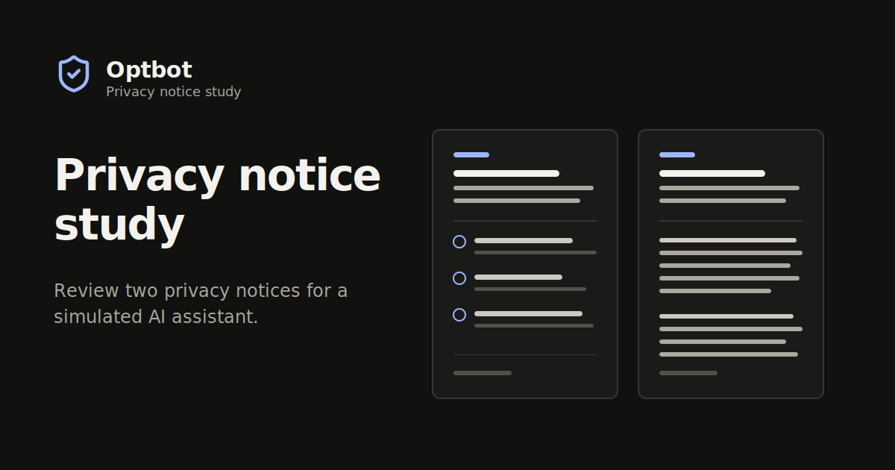

<p align="center">
  <a href="https://optbot.study/">
    
  </a>
</p>

# Optbot Privacy Notice Study

[](https://github.com/ecan0/optbot/actions/workflows/ci.yml)
[](https://github.com/ecan0/optbot/releases/latest)
[](https://optbot.study/)
[](https://nodejs.org/en/about/previous-releases)
[](LICENSE)

Optbot is a research survey that compares two privacy notices for a simulated artificial intelligence assistant. Participants review both notices in randomized order, answer structured questions, and submit one validated response.

Visit the [live privacy notice study](https://optbot.study/) or use this repository to review, test, and deploy the application.

## What the project does

The application supports a focused research workflow:

- Presents consent, study instructions, two privacy notices, and follow-up questions
- Randomizes notice order per browser session to reduce presentation-order bias
- Validates required answers and response shape before submission
- Runs without submission in preview mode
- Protects live submissions with Cloudflare Turnstile
- Deploys a static React application and a narrow serverless response API on Amazon Web Services (AWS)

## Run the study locally

Install Node.js 22 and npm, then run:

```bash
npm install
cp .env.example .env.local
npm run dev
```

Vite prints the local address. Preview mode is the default and never submits responses.

For setup details, read [Run Optbot locally](docs/getting-started.md). For environment variables, read [Configure collection and deployment](docs/configuration.md).

## Documentation

The [documentation index](docs/README.md) groups guides by task. Start with:

- [Understand the system architecture](docs/architecture.md)
- [Develop and verify changes](docs/development.md)
- [Configure continuous integration and releases](docs/ci-and-release.md)
- [Deploy Optbot on AWS](docs/aws-deployment.md)
- [Protect the public repository boundary](docs/public-repo-boundary.md)

## Technology

Optbot uses React 19, TypeScript, Vite, XState, Zod, GSAP, Vitest, Terraform, and AWS serverless services. The production path uses CloudFront, Amazon S3, API Gateway, AWS Lambda, and DynamoDB.

## Contributing

Create a short-lived branch and open a pull request against `main`. Run the required checks before requesting review:

```bash
npm run check
npm run check:public
```

Infrastructure changes also require the Terraform checks in [Develop and verify changes](docs/development.md). Never commit participant responses, credentials, Terraform state, or private infrastructure values.

## License

Copyright (c) 2026 Eric Candela. Original project code and documentation are available under the [MIT License](LICENSE).

Third-party software, fonts, icons, and research materials remain subject to their respective terms. Participant responses and other research data aren't included in this license.

Use [`CITATION.cff`](CITATION.cff) to cite the software. Record academic sources and adapted research materials in [Document research sources](docs/research-sources.md).
