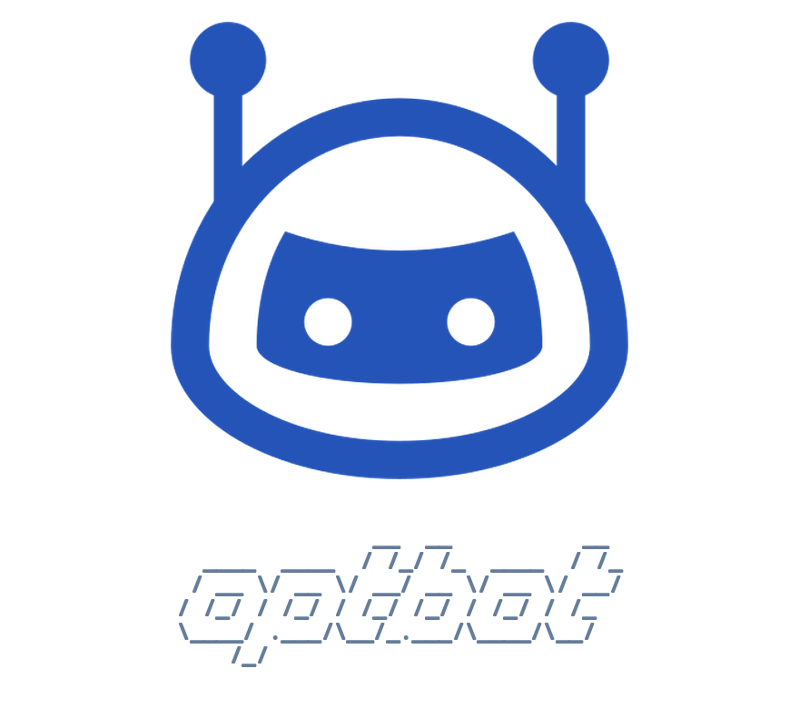

<p align="center">
  <a href="https://optbot.study/">
    
  </a>
</p>

# Optbot privacy notice study

[](https://github.com/ecan0/optbot/actions/workflows/ci.yml)
[](https://optbot.study/)
[](LICENSE)

Optbot is an archived academic research project comparing two privacy notices for a simulated artificial intelligence assistant.

> **Data collection is closed.** The public site remains online as a read-only demonstration. Reactivating collection, analytics, or deployment requires a new approved research and privacy review.

[Read the final paper](publications/Data%20In%2C%20or%20Privacy%20Out_.pdf) · [Explore the demo](https://optbot.study/) · [Read the archive record](docs/archive.md)

## About the study

Participants reviewed both notices in randomized order and answered structured questions about each. The repository preserves the study application, public materials, documentation, and final paper. Participant responses and private research records are not included.

The application includes:

- Consent, study instructions, and two privacy notices
- Randomized notice order and required-answer validation
- A local preview that never submits responses
- A static React frontend and an Amazon Web Services (AWS) response API

## Run locally

Install Node.js 22 and npm, then run:

```bash
npm ci
cp .env.example .env.local
npm run dev
```

Open the local address printed by Vite. The example configuration uses preview mode, which never submits responses or requires AWS credentials.

See [local setup](docs/getting-started.md) for prerequisites and [configuration](docs/configuration.md) for environment variables.

## Documentation

Use the [documentation index](docs/README.md) for all guides, or go directly to:

- [System architecture](docs/architecture.md)
- [Development and verification](docs/development.md)
- [Continuous integration and releases](docs/ci-and-release.md)
- [AWS deployment reference](docs/aws-deployment.md)
- [Public repository boundary](docs/public-repo-boundary.md)

## Technology

The frontend uses React, TypeScript, and Vite, with XState for survey flow, Zod for validation, and GSAP for animation. Vitest runs the tests. Terraform defines the AWS infrastructure: CloudFront, S3, API Gateway, Lambda, and DynamoDB.

## Contributing

Create a short-lived branch and open a pull request against `main`. Run the required checks before requesting review:

```bash
npm run check
npm run check:public
npm run audit:deps
```

Infrastructure changes also require the Terraform checks in [Develop and verify changes](docs/development.md). Never commit participant responses, credentials, Terraform state, or private infrastructure values.

## Citation and credits

Use [`CITATION.cff`](CITATION.cff) to cite the software. See [research sources](docs/research-sources.md) for guidance on citing academic sources and adapted materials.

The robot artwork is adapted from [Robot icons created by edt.im on Flaticon](https://www.flaticon.com/free-icons/robot), recolored and paired with an ASCII wordmark.

## License

Copyright (c) 2026 Eric Candela. Original project code and documentation are available under the [MIT License](LICENSE).

Third-party software, fonts, icons, and research materials retain their respective terms. The license does not cover participant responses or other research data.
