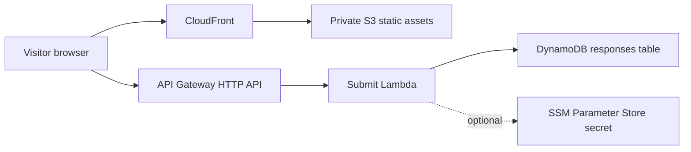

# Architecture

OptBot uses a small AWS serverless deployment for public production.

## Why AWS-first

The public study site needs predictable internet availability and a narrow security boundary. Keeping production in AWS avoids exposing private infrastructure and removes the operational coupling between survey collection and local services.

## Domain

`optbot.study` is the only public domain this repo assumes. DNS can remain in Cloudflare. CloudFront requires an ACM certificate in `us-east-1` before the custom domain alias is enabled.

## Data Flow

The browser submits normalized response JSON to `POST /v1/responses`. The Lambda handler validates shape and origin, optionally verifies Turnstile, then writes a single item to DynamoDB with a TTL timestamp.
